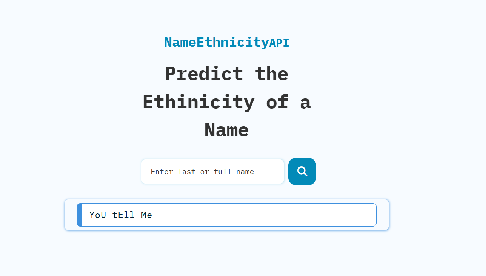

# 🌍 Name Ethinicity

## 🥄Table of Contents

- [ What's Special In this Repo✨](#-nationalizeapi-replica)
  - [ What is Nationalize API🧠](#-what-is-nationalize-api)
- [ Features](#-features)
- [ A Live Demo](#try-it-out)
- [ Screenshot📸](#-screenshot)
- [ Built With🛠️](#️-built-with)
- [ Getting Started](#-getting-started)
- [ How to Use the Site](#-usage)
- [ Example API Response](#-example-api-response)
- [ How It Works🤔](#-how-it-works)
- [ Error Handling❗❗](#-error-handling)
- [ Acknowledgments🙌 ](#-acknowledgments)
- [ License📜 ](#-license)
- [ Contact💬 ](#-contact)
  - [Ask a question](#for-questions-confirmation-or-collaboration-find-me-at)

---

## ABOUT THIS REPO

This project is a simple frontend replica of the [Nationalize API](https://nationalize.io/), used to predict the nationality of a given name. Built using JavaScript and modern web practices, this tool demonstrates how to make HTTP requests to public APIs and display results dynamically.

### 🧠 What is Nationalize API?

Nationalize.io predicts the nationality of a person based on their name using data from various countries. For example, the name "Brian" might be common in both Kenya and United States.

---

## 🪶 Features

- 🔍 Search nationality by name
- 🌐 Uses the free [Nationalize.io API](https://api.nationalize.io/?name=son)
- 🧾 Clean, user-friendly UI
- ⚡ Async/Await + Fetch API calls
- ❌ Handles loading and error states

---

## 🫵 Try it out :

> Live Link: [DemoLinkHere.com](#)

---

## 📸 Screenshot



---

## 🛠️ Built With

- HTML5
- CSS3 (or Tailwind/Bootstrap if applicable)
- JavaScript (ES6+)
- Fetch API or Axios
- [Nationalize.io](https://nationalize.io/)

---

## 📦Getting Started:

1. Clone the repo:

```bash
git clone https://github.com/your-username/nationalizeapi-replica.git

```

---

## How to Use the Site

Type any first name in the input field and hit "Submit" or press Enter. The app will call the Nationalize API and return a list of countries with probability scores where that name is likely used.

---

## Example API Response

```json
{
  "name": "andrea",
  "country": [
    { "country_id": "IT", "probability": 0.15 },
    { "country_id": "DE", "probability": 0.09 }
  ]
}
```

---

## 🤔 How It Works

1. User inputs a name.

1. JS sends a GET request to https://api.nationalize.io/?name=<name>.

1. The response includes an array of possible countries and probabilities.

1. The UI updates to display the results.

---

## ❗ Error Handling

A. Displays error messages when:

B. The name field is empty.

C. Network request fails.

---

## 🙌 Acknowledgments

Thanks to Nationalize.io for providing the free API.

Inspired by learning projects and frontend practice tools.

---

## 📜 License

No License for Now

---

## 💬 Contact

### For questions, confirmation or collaboration find me at:

GitHub Username: [WaithakaGuru](https://github.com/WaithakaGuru)

Email: waithakaoffices@gmail.com

---

## Waithaka Amos Out!! :)
